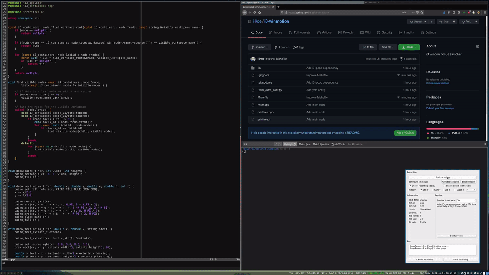
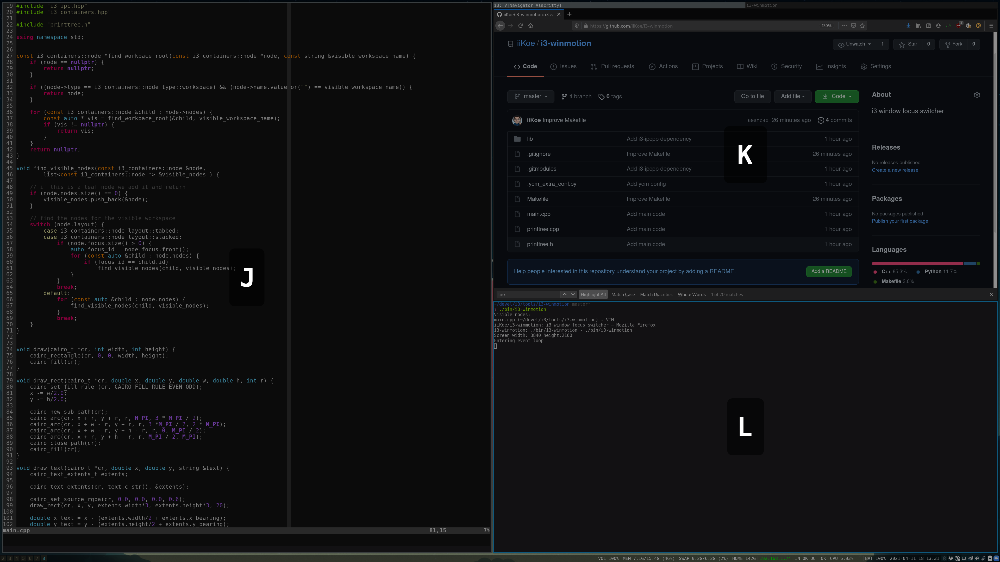
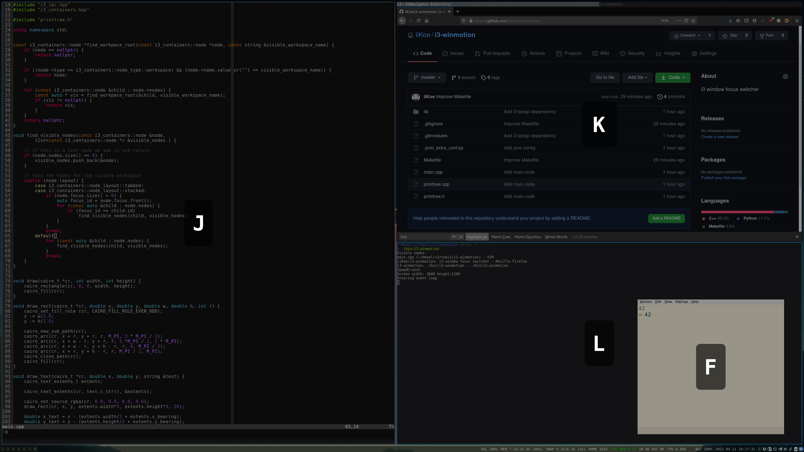

# i3-winmotion

i3-winmotion is a tool that allows you to move between **visible** [i3](https://i3wm.org/)
windows using specified hint keys (see the demo below).

The credits for the idea go to [pcharest2000/winswitch](https://github.com/pcharest2000/winswitch)
and [svenstaro/wmfocus](https://github.com/svenstaro/wmfocus).
i3-winmotion is a complete rewrite using the i3-ipc bindings provided by
[i3-ipcpp](https://github.com/Iskustvo/i3-ipcpp), which allows i3-winmotion to
**only highlight visible windows**, avoiding overlapping or (in my opinion) confusing hints.
This is done by traversing the i3 JSON workspace layout and enabling hints only for the visible
windows in a tab or stack.

## How it works
i3-winmotion uses the hint keys (default: 'asdfjkl') to create 'hints'
consisting of the minimum number of characters to create unique hints.
Each visible window is assigned a hint. Entering the displayed hint causes the
corresponding window to become focused. Pressing escape exits the application
and keeps the focus unchanged.

For example, if there are 2 hint keys and 2 visible windows, each window will
have one unique hint key assigned. However, if there are 2 hint keys and 3
visible windows i3-winmotion will assign hints consisting of 2 keys to each
window as each hint has to be a unique combination of the hint keys.

_Note that the hints are displayed as uppercase, but the expected key presses are
lowercase._

## Requirements
* i3
* [RapidJSON](https://rapidjson.org/)
* A compositor that supports drawing overlays (e.g., [picom](https://github.com/yshui/picom)).

## Building
Simply run `make` in the root of the project.

It will automatically initialize the
i3-ipcpp submodule and compile i3-ipcpp (if it's not already compiled).
Then it will compile i3-winmotion and place the resulting binary in `./bin`.

## Usage
```
OVERVIEW: i3-winmotion window visible window switcher

USAGE: i3-winmotion [options]

 -k, --hint-keys <keys>       Hint key string used to generate hints (default: 'jklfdsa')
 -o, --fullscreen-overlay     Add a slightly black transparent background
 -f, --font <name>            Hint font (default: monospace)
 -s, --font-size <size>       Hint font size (default: 100)
 -w, --hint-floating          Draw hints on floating windows
 -h, --help                   Display this help and exit
```

## Differences With Other Window Switchers
I'm not saying anything negative about the other window switchers.
They are great, just not ideal for **my** workflow.

* [pcharest2000/winswitch](https://github.com/pcharest2000/winswitch)
does not use any i3 information resulting in overlapping hints for tabbed and stacked windows.

* [svenstaro/wmfocus](https://github.com/svenstaro/wmfocus)
does use i3 information but also draws hints for all the hidden windows in a tab or stack.
For my workflow, with a lot of tabs with splits in it, this quickly becomes confusing.

## Demo



